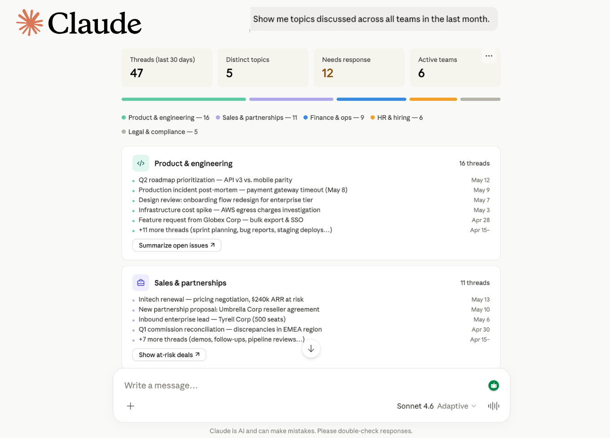
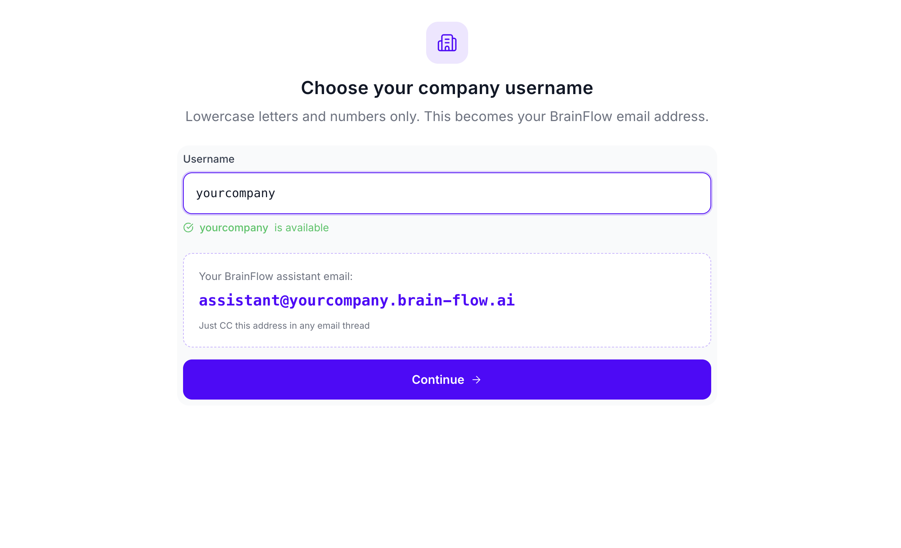
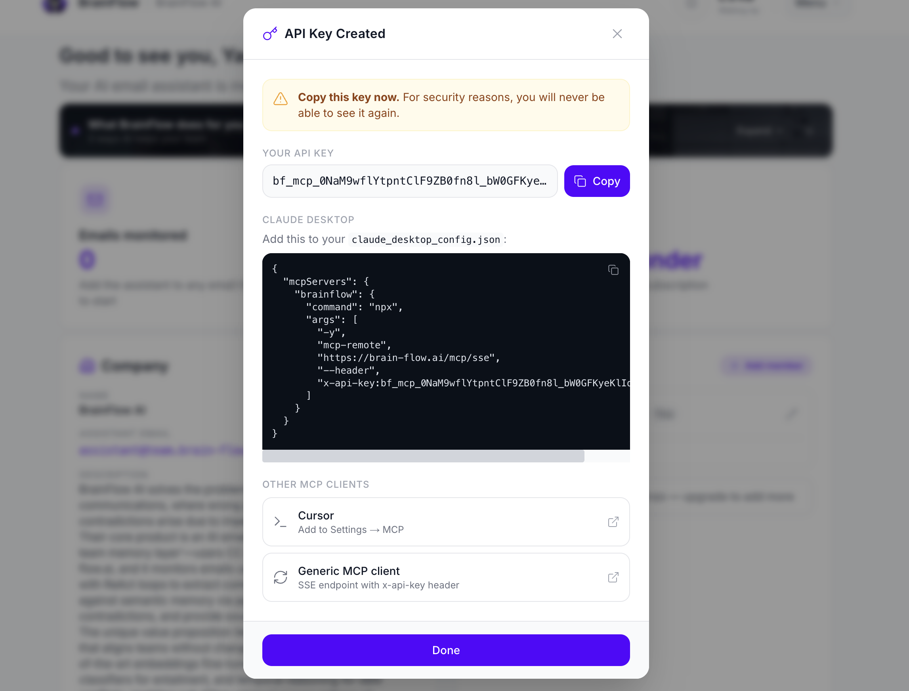
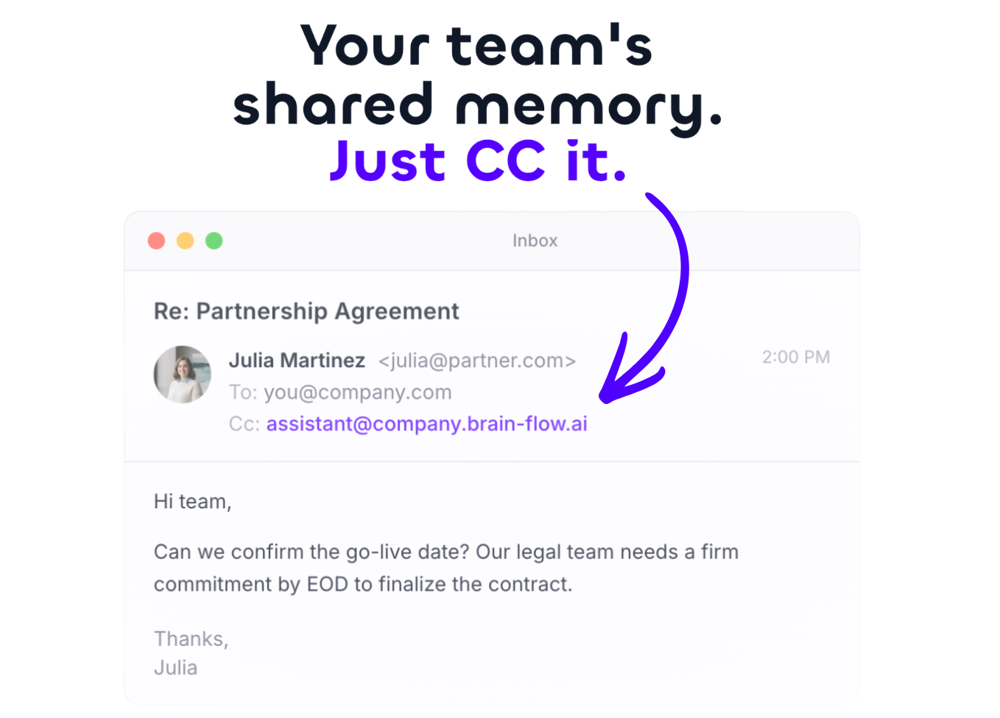

# BrainFlow: The Brain of Your Company (MCP Server)

Your company's brain, connected to Claude, ChatGPT, Gemini, Cursor, and VS Code. Turn your team's email history into shared memory that any AI assistant can query with natural language.

**🌐 [brain-flow.ai](https://brain-flow.ai)**



## Features

- **Natural Language Queries** — Ask questions in plain English. The AI translates to SQL and returns sourced answers.
- **Team Memory Search** — Query emails, tasks, deals, and decisions across your entire company workspace.
- **Cross-Team Context** — Sales handoffs to ops, legal feedback to product, marketing summaries for leadership — all connected.
- **Multi-Platform** — Works with Claude (Web + Desktop), ChatGPT, Gemini, Cursor, and VS Code Copilot.
- **Company-Scoped Security** — Every query is automatically filtered to your company. No cross-tenant data leakage.
- **Read-Only** — Only `SELECT` queries are permitted. No write, delete, or modify operations possible.
- **Audit Trail** — Every API key usage is tracked with timestamps.

## Prerequisites

- Active [BrainFlow](https://brain-flow.ai) account
- BrainFlow API key (generated from your dashboard)
- MCP-compatible AI assistant (Claude, ChatGPT, Gemini, Cursor, or VS Code)

## BrainFlow Pricing

The MCP server is **included free** with every BrainFlow subscription. No separate MCP charge.

| Plan | Price | Users | MCP Access | Rate Limits |
|------|-------|-------|------------|-------------|
| **Founder** | $19.90/mo ($15.90/mo billed annually) | 1 | ✅ Full access | Standard |
| **Startup** | $99.90/mo ($79.90/mo billed annually) | Up to 10 | ✅ Full access | Higher |
| **Corporate** | $899.90/mo ($599.90/mo billed annually) | Up to 100 | ✅ Full access | Highest |

- **7-day free trial** on all plans
- **30-day refund guarantee**
- **Cancel anytime**

[View full pricing →](https://brain-flow.ai/pricing)

## How It Works

### 1. Create your BrainFlow account

Sign up at [brain-flow.ai](https://brain-flow.ai) and create your company workspace.



### 2. Get your BrainFlow API key

Generate an API key from your BrainFlow Dashboard. This is what you'll use to connect your AI assistant.



### 3. Include BrainFlow in CC

Add your BrainFlow email to the CC of any email thread you want to remember. BrainFlow automatically ingests and indexes the conversation.



### 4. Query with natural language

Connect your AI assistant via MCP and ask questions about any thread your team has shared.

---

## Setup

### Generate an API key

In your BrainFlow dashboard:

1. Go to **Settings → API Keys**
2. Click **Generate key**
3. Name it (e.g. "Claude Desktop")
4. Copy the key — you will only see it once

### Connect your AI assistant

**Claude (Web)**  
Go to **Customize → Connectors → Add custom connector**  
- **Name:** `BrainFlow`  
- **URL:** `https://brain-flow.ai/mcp/sse?api_key=bf_mcp_YOUR_KEY_HERE`

**Claude Desktop**  
Go to **Settings → Developer → Edit Config**:

```json
{
  "mcpServers": {
    "brainflow": {
      "command": "npx",
      "args": [
        "-y",
        "mcp-remote",
        "https://brain-flow.ai/mcp/sse",
        "--header",
        "x-api-key:bf_mcp_YOUR_KEY_HERE"
      ]
    }
  }
}
```

**ChatGPT** (requires Developer Mode beta)  
Settings → Apps → Advanced settings → Enable Developer Mode → Create app  
- **Name:** `BrainFlow`  
- **URL:** `https://brain-flow.ai/mcp/sse?api_key=bf_mcp_YOUR_KEY_HERE`

**Gemini**  
```bash
gemini mcp add brainflow https://brain-flow.ai/mcp/sse --header "x-api-key:bf_mcp_YOUR_KEY_HERE"
```

**VS Code**  
Add to your `settings.json`:

```json
{
  "mcp": {
    "inputs": [],
    "servers": {
      "brainflow": {
        "command": "npx",
        "args": [
          "-y",
          "mcp-remote",
          "https://brain-flow.ai/mcp/sse",
          "--header",
          "x-api-key:bf_mcp_YOUR_KEY_HERE"
        ]
      }
    }
  }
}
```

**Cursor**  
1. Open Cursor Settings (Cmd/Ctrl + ,)
2. Go to MCP
3. Add the BrainFlow server config above
4. Query in Composer while you code

Replace `YOUR_KEY_HERE` with your actual API key. Restart your assistant and start asking questions.

---

## What You Can Ask

### Cross-team handoffs
| Question | What you get |
|----------|--------------|
| "What commitments did sales make to Delta Corp that operations should know about?" | Sourced commitments with links to original threads |
| "Has anyone from engineering spoken to Acme Corp about the API issues?" | Team member names, dates, and conversation summaries |
| "Which prospects did BD reach out to that we already have contracts with?" | Overlap detection between prospects and existing clients |

### Team activity & decisions
| Question | What you get |
|----------|--------------|
| "Summarize the marketing team's exchanges over the last week." | Weekly summary with key topics and decisions |
| "What did product decide about the Q3 roadmap in their last sync?" | Decision points and action items from product threads |
| "Show me unresolved high-priority tasks across all teams." | Filtered task list with assignees and deadlines |

### Documents & contracts
| Question | What you get |
|----------|--------------|
| "What did legal say about the Alpha contract terms?" | Legal feedback summary with clause references |
| "Find all Q3 budget discussions across departments." | Aggregated budget threads with dollar amounts |

### Company-wide insights
| Question | What you get |
|----------|--------------|
| "Summarize client feedback the support team collected this month." | Themed feedback summary with sentiment trends |
| "Which topics came up most in leadership emails this quarter?" | Topic frequency analysis with top threads |

---

## Security

- **Read-only.** The server only runs `SELECT` queries. `INSERT`, `UPDATE`, `DELETE`, `DROP`, `CREATE`, `UNION`, and subqueries are all blocked at the parser level.
- **Company-scoped filtering.** Every query is automatically injected with `company_id = 'YOUR_COMPANY_UUID'` before execution. No manual filter needed, no filter bypass possible.
- **API key validation.** Keys are SHA-256 hashed and validated on every request. Revoked or inactive keys are rejected immediately.
- **UUID-enforced scoping.** Company IDs are validated as proper UUIDs before any query execution, preventing injection attacks.
- **No external APIs.** Your data never leaves your database. No third-party API calls are made during query processing.
- **Audit trail.** Each key records `last_used_at` timestamp on every successful request.
- **Rate limiting.** Fair-use limits apply per plan tier to prevent abuse.

For security issues, email hello@brain-flow.ai.

## License

MIT
